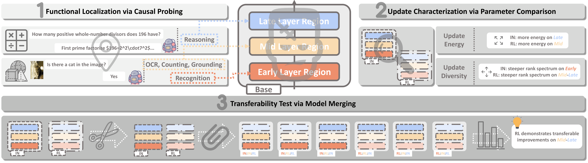

# 🧟 Frankenstein-Analysis

**What Does Reinforcement Learning Really Change in Visual Reasoning?**

A Frankenstein-style analysis framework for understanding *where* reinforcement learning (RL) alters vision-language models (VLMs) and *what* changes across the training pipeline (Base → SFT/IN → RL).

<p align="center">
  
</p>

## 🔑 Key Findings

- 📉 **No monotonic improvement.** Despite end-to-end benchmark gains, vision ability, reasoning ability, and vision-to-reasoning alignment do not improve monotonically from Base → IN → RL.
- 👁️ **Consistent attention shift.** Across diverse training recipes, RL consistently increases attention from reasoning tokens to visual tokens, primarily in mid-to-late transformer layers.
- 🧬 **Structured parameter updates.** RL refinements concentrate in mid-to-late layers, are transferable across recipes, and contribute primarily to improved vision-to-reasoning alignment and reasoning performance.

## 🏗️ Framework Overview

The framework consists of three analysis components and one validation step:

| Component | Goal | Method | Script |
|---|---|---|---|
| 🔬 **Functional Localization** | *Where* do vision/reasoning abilities reside? | Causal probing across transformer depth | `localization_vision.py`, `localization_reasoning.py` |
| 📊 **Update Characterization** | *What* does RL change structurally? | SVD spectral analysis & Frobenius norm comparison | `characterisation_diversity.py`, `characterisation_energy.py` |
| 🧩 **Transferability Test** | Are RL updates *transferable*? | Block-wise model merging | `transferability_test.py` |
| ❄️ **Necessity Validation** | Are mid-late layer updates *necessary*? | Block-wise parameter freezing during RL | *(external training script)* |

## 🤖 Supported Training Recipes

All experiments use `Qwen/Qwen2.5-VL-7B-Instruct` as the base model with the following IN+RL pairs:

| Recipe | IN (SFT) Model | RL Model |
|---|---|---|
| OpenMMReasoner | `OpenMMReasoner/OpenMMReasoner-ColdStart` | `OpenMMReasoner/OpenMMReasoner-RL` |
| Revisual-R1 | `csfufu/Revisual-R1-Coldstart` | `csfufu/Revisual-R1-final` |
| MMR1 | `MMR1/MMR1-7B-SFT` | `MMR1/MMR1-7B-RL` |

## ⚙️ Setup

```bash
conda create -n frankenstein python=3.10
conda activate frankenstein
pip install -r requirements.txt
```

For experiments that use GPT-based grading (transferability test), set your OpenAI API key:

```bash
export OPENAI_API_KEY="your-api-key"
```

## 🚀 Usage

All experiments are launched from the project root via shell scripts in `runs/`.

### 1. 🔬 Functional Localization

**Vision localization** measures how visual token swapping at each layer affects model output:

```bash
bash runs/localization_vision.sh
```

The script evaluates four vision tasks (counting, OCR, grounding, recognition) using a custom dataset under `dataset/`. At each target layer, visual tokens from a source image are swapped into the KV cache, and the resulting output change rate is measured.

**Reasoning localization** measures accuracy degradation when zero-ablating each layer on math benchmarks (GSM8K, MATH-500):

```bash
bash runs/localization_reasoning.sh
```

For each layer *i*, the attention + MLP output is set to zero (keeping the skip connection), isolating each layer's contribution to reasoning.

### 2. 📊 Update Characterization

**SVD analysis** compares the singular value spectra of weight deltas between IN and RL phases:

```bash
bash runs/characterisation_diversity.sh
```

**Energy analysis** compares Frobenius norms of weight deltas layer by layer:

```bash
bash runs/characterisation_energy.sh
```

Both scripts analyze all layers across the vision encoder, projector, and LLM backbone using a unified layer indexing scheme.

### 3. 🧩 Transferability Test

Evaluates whether transplanting RL-refined layer blocks into IN models preserves functional improvements. Tests multiple block-wise splicing configurations (early/mid/late thirds):

```bash
bash runs/run_eval_v1_openmmreasoner.sh
bash runs/run_eval_v1_revisual.sh
bash runs/run_eval_v1_mmr1.sh
```

Each run evaluates the original SFT/RL models alongside six Frankenstein variants on perception (General VQA), alignment (Math VQA), and reasoning (MATH-500) tasks.

## 📁 Project Structure

```
Frankenstein-Analysis/
├── scripts/                          # Core analysis scripts
│   ├── localization_vision.py        # Vision localization via visual token swapping
│   ├── localization_reasoning.py     # Reasoning localization via zero ablation
│   ├── characterisation_diversity.py # Layer-wise SVD spectral analysis
│   ├── characterisation_energy.py    # Layer-wise Frobenius norm analysis
│   └── transferability_test.py       # Block-wise model merging evaluation
├── utils/
│   └── vision_token_swapper.py       # Visual token swapping utility (KV cache manipulation)
├── runs/                             # Shell scripts to launch experiments
├── dataset/                          # Vision functionality dataset (counting, OCR, grounding, recognition)
├── results/                          # Output directory (gitignored)
├── requirements.txt
├── LICENSE
└── README.md
```

## 📂 Results

All results are saved under `results/`, organized by experiment type and model:

```
results/
├── localization_vision/{Model_Name}/
├── localization_reasoning/{Model_Name}/{dataset}/
├── characterisation_diversity/{Recipe}/
├── characterisation_energy/{Recipe}/
└── transferability_test/{Recipe}/
```

## 📝 Citation

```bibtex
@article{frankenstein2025,
  title   = {What Does Reinforcement Learning Really Change in Visual Reasoning?},
  author  = {},
  year    = {2025}
}
```

## 📄 License

This project is licensed under the [MIT License](LICENSE).
